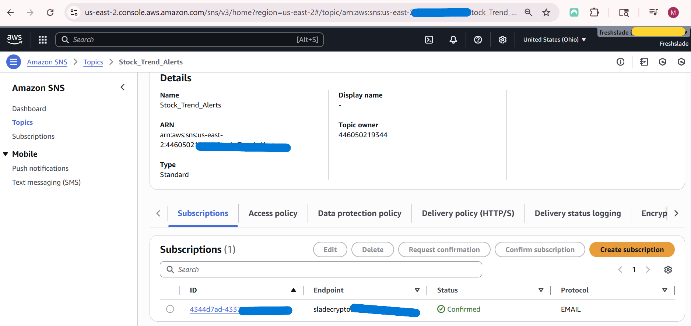

# AWS Stock Trend Pipeline — Near Real-Time Analytics (Kinesis → Lambda → DynamoDB/S3 → Athena → SNS)

A near real-time, event-driven stock analytics pipeline on AWS. It ingests live prices (AAPL via `yfinance`) into **Kinesis**, processes records with **Lambda**, persists **processed** data in **DynamoDB**, archives **raw** JSON in **S3**, runs **SQL** analytics with **Athena/Glue**, and sends **trend alerts** via **SNS**. Designed to be **serverless**, **low-cost**, and easy to extend.

> ⚠️ This is “near real-time” (≈30s producer delay + Kinesis batch size) for cost control.

---

## ✨ Highlights
- **Streaming ingestion**: Kinesis Data Streams
- **Serverless processing**: Lambda (Kinesis trigger)
- **Low-latency store**: DynamoDB (`symbol` + `timestamp`)
- **Cold storage + analytics**: S3 (raw JSON) + Glue + Athena
- **Alerts**: SNS (email/SMS) using SMA(5)/SMA(20) crossover
- **Cost awareness**: on-demand stream, serverless, minimal retention

---

## 🧱 Architecture & Services

- **Kinesis Data Streams** – `stock-market-stream` for live events  
  

- **Lambda (Processor)** – decodes Kinesis, saves raw → **S3**, computes metrics, writes processed → **DynamoDB**  
  
  
  

- **DynamoDB** – table `stock-market-data` (PK: `symbol` [S], SK: `timestamp` [S])  
  

- **S3 (raw)** – `raw-data/<symbol>/<timestamp>.json` for Athena/ML later  
  

- **Glue + Athena** – external table on S3 JSON to query history  
  
  

- **SNS** – topic `Stock_Trend_Alerts` for BUY/SELL crossovers  
  

- **Lambda (Trend Analysis)** – reads latest window from DynamoDB, computes SMA5/SMA20, publishes to SNS  
  
  
  

---

🧪 Example Athena Queries

Top 5 price changes
SELECT symbol, price, previous_close,
       (price - previous_close) AS price_change
FROM stock_data_table
ORDER BY price_change DESC
LIMIT 5;

Average volume
SELECT symbol, AVG(volume) AS avg_volume
FROM stock_data_table
GROUP BY symbol;
Anomalies (>5%)
SELECT symbol, price, previous_close,
       ROUND(((price - previous_close) / previous_close) * 100, 2) AS change_percent
FROM stock_data_table
WHERE ABS(((price - previous_close) / previous_close) * 100) > 5;
🧰 Troubleshooting Notes (what I had to solve)

This section captures the real bumps I hit and how I fixed them:

pip not recognized on Windows

Root cause: Python not on PATH / Store aliases intercepting python

Fix: Disable App execution aliases for python.exe, add Python & Scripts folders to PATH, or clean-reinstall from python.org with “Add to PATH” checked.

Running script from wrong directory

Error: can't open file 'C:\\Users\\Slade\\stream_stock_data.py'

Fix: cd Downloads (where the file lives) or run python "C:\full\path\stream_stock_data.py".

Kinesis stream name validation

Error: ValidationException ... Value 'stock-market-stream ' ...

Fix: Removed trailing space in STREAM_NAME → stock-market-stream.

Region mismatch

Error: ResourceNotFoundException ... Stream ... not found

Fix: Ensure both stream and code use us-east-2

kinesis_client = boto3.client("kinesis", region_name="us-east-2")

